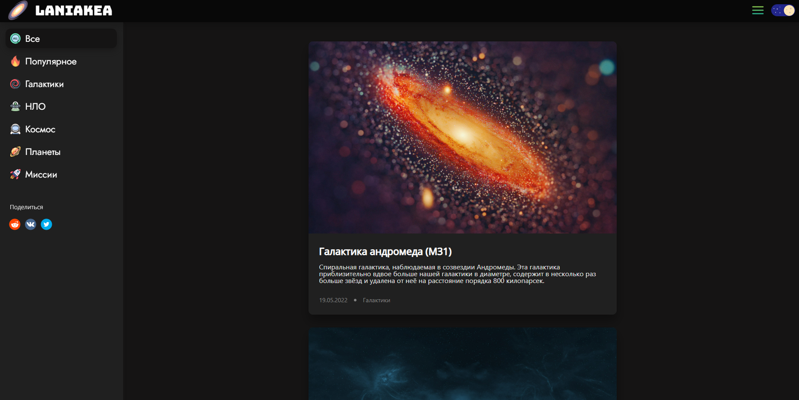
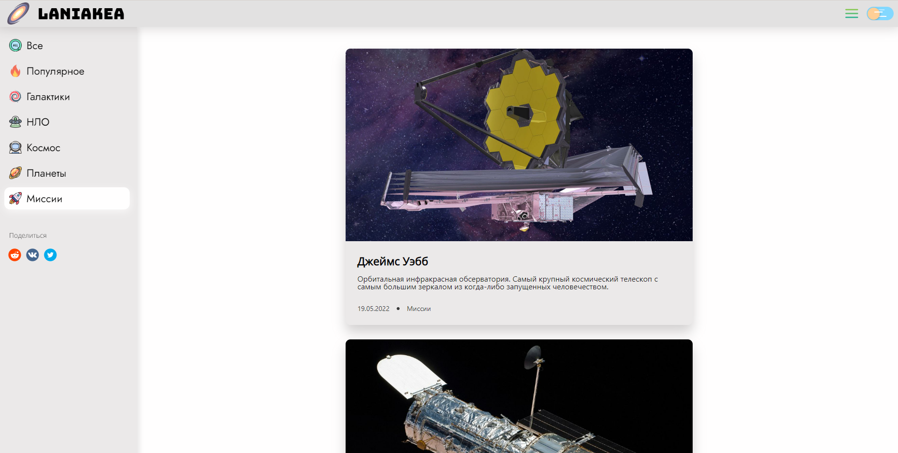
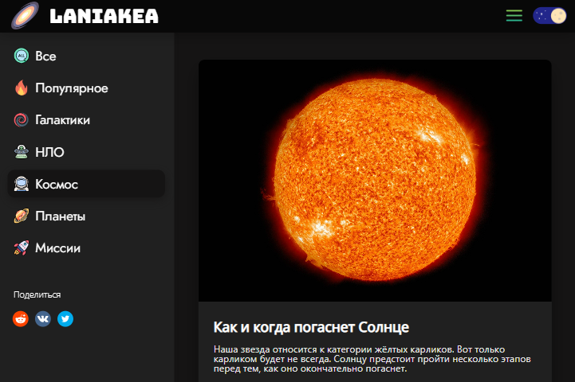
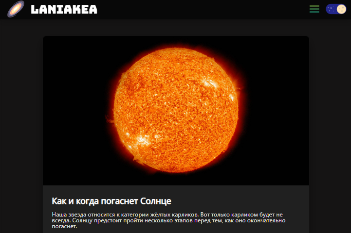

# 
LANIAKEA

 

---

### Описание

Новостной сайт с космической тематикой, где можно почитать интересные статьи о космосе, галактиках, планетах, космических аппаратах и многом другом.

---
### Стек:
- ReactJS
- TypeScript
- SCSS
- Redux
- mockAPI
- React Router v6
---
### Темная и светлая тема:

Есть возможность выбирать стетлую или тёмную тему.

 

### Бургер меню:

В любой момент бургер меню можно убрать или наоборот добавить

 

 

